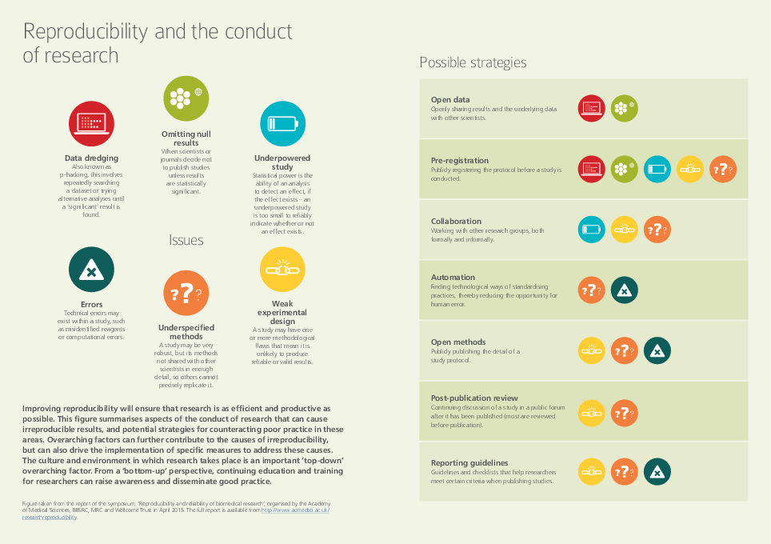

# Reproducible research

> D Knuth: [Literate programming](http://literateprogramming.com/) is a
> methodology that combines a programming language with a
> documentation language, thereby making programs more robust, more
> portable, more easily maintained, and arguably more fun to write
> than programs that are written only in a high-level language.

<br />

> [D. Donoho](http://statweb.stanford.edu/~donoho/): An article about
> computational science in a scientific publication is not the
> scholarship itself, it is merely advertising of the scholarship. The
> actual scholarship is the complete software development environment
> and the complete set of instructions which generated the figures.

<br />

> R. Gentleman and D. Temple Land,
> [Statistical Analyses and Reproducible Research](http://biostats.bepress.com/bioconductor/paper2/) 2004. We
> introduce the concept of a compendium as both a container for the
> different elements that make up the document and its computations
> (i.e. text, code, data, ...), and as a means for distributing,
> managing and updating the collection.

## Nomenclature


- Reproducibility/reproduce


- Replication/replicate

Other terms: mechanical reproducibility, repeat/repeatability, re-use 


## Why 

#### Open science

Better science and moral argument

But also

#### [Five selfish reasons to work reproducibly](http://genomebiology.biomedcentral.com/articles/10.1186/s13059-015-0850-7)

1. Reproducibility helps to avoid disaster
2. Reproducibility makes it easier to write papers
3. Reproducibility helps reviewers see it your way
4. Reproducibility enables continuity of your work
5. Reproducibility helps to build your reputation

## Tools

#### R and Sweave/knitr

1. Input: A text document with text and code chunks (that computer,
   generates tables and figures).

2. Extract the code chunks and execute the code.

3. Replace the code chunks by their respective outputs.

4. Compile the text document into pdf, html, ...


In R, one would use `Sweave` or the `knitr` package

Starting from markdown and R code (Rmarkdown)

```
Rmd -> md -> html | pdf
```

Starting from LaTeX and R code

```
Rnw -> tex -> pdf
```

#### [Jupyter](http://jupyter.org/) notebook

Previously known as IPython notebooks.

#### Other

`org-mode`

### Reproducibility and the conduct of research



(as [pdf](./figs/Reproducibility_issues_and_possible_strategies.png))


Figure taken from the report of the symposium, ‘Reproducibility and
reliability of biomedical research’, organised by the Academy of
Medical Sciences, BBSRC, MRC and Wellcome Trust in April 2015. The
full report is available from
http://www.acmedsci.ac.uk/researchreproducibility.

### Best practice 

Wilson G *et al.*
[Best Practices for Scientific Computing](http://journals.plos.org/plosbiology/article?id=10.1371/journal.pbio.1001745)
2014.

1. Write programs for people, not computers.
   - A program should not require its readers to hold more than a handful of facts in memory at once.
   - Make names consistent, distinctive, and meaningful.
   - Make code style and formatting consistent.
2. Let the computer do the work.
   - Make the computer repeat tasks.
   - Save recent commands in a file for re-use.
   - Use a build tool to automate workflows.
3. Make incremental changes.
   - Work in small steps with frequent feedback and course correction.
   - Use a version control system.
   - Put everything that has been created manually in version control.
4. Don't repeat yourself (or others).
   - Every piece of data must have a single authoritative representation in the system.
   - Modularize code rather than copying and pasting.
   - Re-use code instead of rewriting it.
5. Plan for mistakes.
   - Add assertions to programs to check their operation.
   - Use an off-the-shelf unit testing library.
   - Turn bugs into test cases.
   - Use a symbolic debugger.
6. Optimize software only after it works correctly.
   - Use a profiler to identify bottlenecks.
   - Write code in the highest-level language possible.
7. Document design and purpose, not mechanics.
   - Document interfaces and reasons, not implementations.
   - Refactor code in preference to explaining how it works.
   - Embed the documentation for a piece of software in that software.
8. Collaborate.
   - Use pre-merge code reviews.
   - Use pair programming when bringing someone new up to speed and when tackling particularly tricky problems.
   - Use an issue tracking tool.

[Prev: Open Science](./02-open-science.md) -- [Next: Conclusions](./04-ccl.md)
