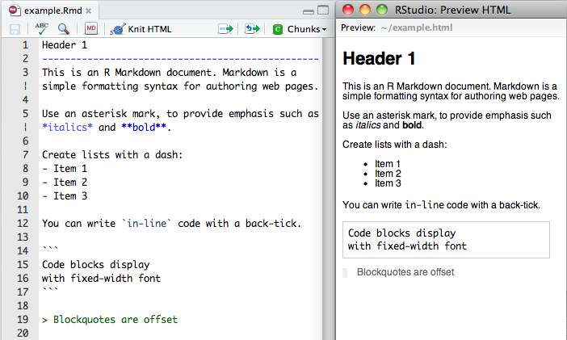
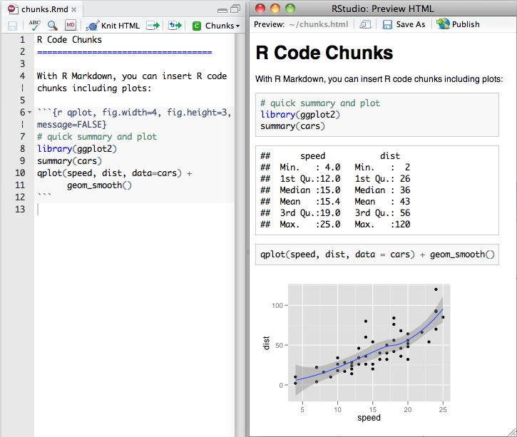

# Reproducible research

> D Knuth: [Literate programming](http://literateprogramming.com/) is a
> methodology that combines a programming language with a
> documentation language, thereby making programs more robust, more
> portable, more easily maintained, and arguably more fun to write
> than programs that are written only in a high-level language.

<br />

> [D. Donoho](http://statweb.stanford.edu/~donoho/), as pointed out by
> John Claerbout: 'An article about computational science in a
> scientific publication is not the scholarship itself, it is merely
> advertising of the scholarship. The actual scholarship is the
> complete software development environment and the complete set of
> instructions which generated the figures.'

<br />

> R. Gentleman and D. Temple Land,
> [Statistical Analyses and Reproducible Research](http://biostats.bepress.com/bioconductor/paper2/) 2004. We
> introduce the concept of a compendium as both a container for the
> different elements that make up the document and its computations
> (i.e. text, code, data, ...), and as a means for distributing,
> managing and updating the collection.

## Different levels of *reproducibility*

(There is some
[ambiguity](http://languagelog.ldc.upenn.edu/nll/?p=21956) when it
comes to nomenclature. Here, I'll use the one that is most common in
biological/bioinformatics, based on, among others V. Stodden and
R. Peng - see references.)

#### Reproducibility/reproduce

> A study is reproducible if there is a specific set of computational
> functions/analyses (usually specified in terms of code) that exactly
> reproduce all of the numbers in a published paper from raw data.

#### Replication/replicate

> A study is only replicable if you perform the exact same experiment
> (at least) twice, collect data in the same way both times, perform
> the same data analysis, and arrive at the same conclusions.

A study might be reproducible (and this might not be an easy thing to
achieve, in particular for large-scale studies), this does not make is
replicable. The latter is stronger than the former. Replicability
requires new samples and new data (*), which introduces new
variability, and additional risks of errors. Reproducibility is, to
some extent, a technical challenge, while replication gives the
results scientific validity.

(*) in particular biological replicates - see
[statistics lecture on experimental designs](https://github.com/lgatto/statistics-primer).

#### Re-usability

Applying/adapt the software/methodology to a new but related question.


Other terms: mechanical reproducibility, statistical reproducibility,
repeat/repeatability, ...

## Why 

* Reproducible/replicable science is better science. And it's even
  better if science is openly shared, and reproducible/replicable by
  others.

But also

* [Five selfish reasons to work reproducibly](http://genomebiology.biomedcentral.com/articles/10.1186/s13059-015-0850-7)

	1. Reproducibility helps to avoid disaster
	2. Reproducibility makes it easier to write papers
	3. Reproducibility helps reviewers see it your way
	4. Reproducibility enables continuity of your work
	5. Reproducibility helps to build your reputation

## Tools

### R and `Sweave`/`knitr`

```
# Big Analysis Report

## Introduction

Bla bla bla bla bla bla bla bla bla bla bla
bla bla. Bla bla bla bla bla bla bla bla bla
bla bla bla bla bla bla bla.

## Data processing

This is how we do it...

+-------------------------------------+
| library("MSnbase")                  |
| rw <- openMSfile("data.raw")        |
| rw <- normalise(rw)                 |
+-------------------------------------+


## Results

+-------------------------------------+
| xx <- stats(x)                      |
| plot2D(xx)                          |
|  {d}                                |
+-------------------------------------+

## Conclusion

Bla bla bla bla bla bla bla bla bla. Bla
bla bla bla bla bla bla bla bla bla bla bla
bla bla. Bla bla bla.
```
1. Input: A text document with text and code chunks (that computer,
   generates tables and figures).

2. Extract the code chunks and execute the code.

3. Replace the code chunks by their respective outputs.

4. Compile the text document into a final format, such as pdf or html.

In R, one would use `Sweave` or the
[`knitr`](http://www.yihui.name/knitr/) package.

* Starting from markdown and R code (Rmarkdown)

  

* Starting from LaTeX and R code

  

Example:

```{r}
library("knitr")
knit("report.Rmd") ## produces report.md
library("rmarkdown")
render("report.md", ouput_format = "pdf") ## produces report.pdf
render("report.md", ouput_format = "html") ## produces report.html
```




(You will get such an example in the
[statistics practical](https://github.com/lgatto/statistics-primer))

### [Jupyter](http://jupyter.org/) notebook

Previously known as IPython notebooks: python, R, Julia, and many
more. Interactive, in browser.

### [orgmode](http://www.orgmode.org/)

`org-mode`: specific to emacs, many languages.

### Automation using `make`

- `make` is an automatated build system, designed to avoid costly
  recomputation.
- `make` examines a `Makefile`, which contains a set of rules
  describing dependencies among files.
- A rule is run if the *target* is older than any of its *dependencies*.
- Older: compare creation time of files.

```
report.md: report.Rmd
	Rscript -e "knitr::knit('report.Rmd')"

report.pdf: report.md
	Rscript -e "rmarkdown::render('report.md', output_format = 'pdf')"

report.html: report.md
	Rscript -e "rmarkdown::render('report.md', output_format = 'html')"
```

### Version/track your research

- Source code versioning systems such as git, subversion, hg, ... and
  their web interfaces (GitHub, Bitbucket) are invaluable to (1) track
  change over time, (2) save all intermediate states of your work and
  (3) enable/facilitate collaborative work.
  
## Reproducibility and the conduct of research


(as [pdf](./figs/Reproducibility_issues_and_possible_strategies.png))


Figure taken from the report of the symposium, ‘Reproducibility and
reliability of biomedical research’, organised by the Academy of
Medical Sciences, BBSRC, MRC and Wellcome Trust in April 2015. The
full report is available from
http://www.acmedsci.ac.uk/researchreproducibility.

## Best practice 

The tools described above are fantastic way to make ones computational
research reproducible. But it generally not enough. As computational
researchers, or even wet lab scientists that reply on some scripting
or programming, it is important to follow some best practice to make
our work more efficient, more tractable, this making is easier to
reproduce. 

Wilson G *et al.*
[Best Practices for Scientific Computing](http://journals.plos.org/plosbiology/article?id=10.1371/journal.pbio.1001745)
2014.

1. Write programs for people, not computers.
   - A program should not require its readers to hold more than a handful of facts in memory at once.
   - Make names consistent, distinctive, and meaningful.
   - Make code style and formatting consistent.
2. Let the computer do the work.
   - Make the computer repeat tasks.
   - Save recent commands in a file for re-use.
   - Use a build tool to automate workflows.
3. Make incremental changes.
   - Work in small steps with frequent feedback and course correction.
   - Use a version control system.
   - Put everything that has been created manually in version control.
4. Don't repeat yourself (or others).
   - Every piece of data must have a single authoritative representation in the system.
   - Modularize code rather than copying and pasting.
   - Re-use code instead of rewriting it.
5. Plan for mistakes.
   - Add assertions to programs to check their operation.
   - Use an off-the-shelf unit testing library.
   - Turn bugs into test cases.
   - Use a symbolic debugger.
6. Optimize software only after it works correctly.
   - Use a profiler to identify bottlenecks.
   - Write code in the highest-level language possible.
7. Document design and purpose, not mechanics.
   - Document interfaces and reasons, not implementations.
   - Refactor code in preference to explaining how it works.
   - Embed the documentation for a piece of software in that software.
8. Collaborate.
   - Use pre-merge code reviews.
   - Use pair programming when bringing someone new up to speed and when tackling particularly tricky problems.
   - Use an issue tracking tool.

[Prev: Open Science](./02-open-science.md) -- [Next: Conclusions](./04-ccl.md)
