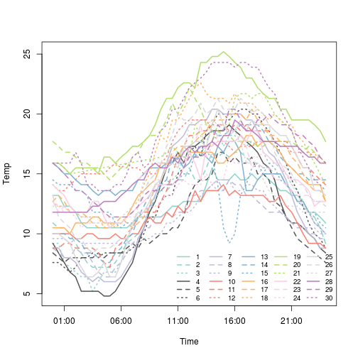

## Weather exercise

- Write your own `weatherdata` function that takes a date character as
  input, locates the file in the `camweather` package directory, loads
  it and returns an appropriate data structure. See section on reading
  data for help.


```r
getweather <- function(dt) {
    require("camweather")
    weatherdata(dt)
}
```


- Write a function that takes a date character of the for
  `"YYYY-MM-DD"` as input and produces a plot of temperature over
  time. Make sure that it remains possible to fully customise the
  figure as would be with `plot`.


```r
plotweather <- function(dt, ...) {
    require("camweather")
    x <- nounits(weatherdata(dt))
    plot(x$Time, x$Temp, ...)
}
```


- Select all the weather files from June 2013. All file names are
  available with the `weatherfiles()` function. You can use the `grep`
  function to select the relevant file names. Check that you obtain 30
  files.


```r
library("camweather")
fls <- weatherfiles()
f <- grep("2013_06", fls, value = TRUE)
length(f)
```

```
## [1] 30
```


- Load the 30 data frames into a convenient data structure. Check the
  number of data points that are available for each weather data set.


```r
xx <- lapply(f, weatherdata)
sapply(xx, nrow)
```

```
##  [1] 49 49 49 49 49 49 49 49 49 49 49 49 49 49 49 49 49 49 49 49 34 49 49
## [24] 49 49 49 49 49 49 49
```

```r
table(sapply(xx, nrow))
```

```
## 
## 34 49 
##  1 29
```


- Calculate the average day temperatures for that month.


```r
sapply(xx, function(x) mean(x[, "Temp [degC]"]))
```

```
##  [1] 12.56 12.48 12.73 12.04 11.05 13.21 13.17 10.74 11.10 11.32 14.22
## [12] 16.54 14.65 14.06 13.29 14.43 15.17 16.79 19.72 17.58 18.10 14.40
## [23] 14.69 13.19 14.11 15.13 14.22 15.60 15.88 18.70
```

```r
## or
dd <- do.call(rbind, xx)
tapply(dd[, 2], dd$Day, mean)
```

```
## 2013-06-01 2013-06-02 2013-06-03 2013-06-04 2013-06-05 2013-06-06 
##      12.56      12.48      12.73      12.04      11.05      13.21 
## 2013-06-07 2013-06-08 2013-06-09 2013-06-10 2013-06-11 2013-06-12 
##      13.17      10.74      11.10      11.32      14.22      16.54 
## 2013-06-13 2013-06-14 2013-06-15 2013-06-16 2013-06-17 2013-06-18 
##      14.65      14.06      13.29      14.43      15.17      16.79 
## 2013-06-19 2013-06-20 2013-06-21 2013-06-22 2013-06-23 2013-06-24 
##      19.72      17.58      18.10      14.40      14.69      13.19 
## 2013-06-25 2013-06-26 2013-06-27 2013-06-28 2013-06-29 2013-06-30 
##      14.11      15.13      14.22      15.60      15.88      18.70
```


- Plot the temperature over the full month and the daily
  temperature curves for June 2013.


```r
plot(dd[, 1], dd[, 2], type = "l",
     xlab = "Time", ylab = "Temp",
     main = "June 2013")
```

 


```r
updateday <- function(x)
    as.POSIXct(strftime(x, "%H:%M"), format = "%H:%M")

library("RColorBrewer")
col <- brewer.pal(10, "Set3")
col[2] <- "#555555"
col <- rep(col, each = 3)
lty <- rep(1:3, 30)

trng <- range(lapply(xx, function(x) x[, "Temp [degC]"]))
plot(updateday(xx[[1]][, 1]),
     xx[[1]][, 2], ylim = trng, type = "l",
     col = col[1], lty = lty[1], lwd = 2,
     xlab = "Time", ylab = "Temp")

for (i in 2:length(xx))
    lines(updateday(xx[[i]][, 1]), xx[[i]][, 2],
          col = col[i], lty = lty[i], lwd = 2)

legend("bottomright", legend = 1:30,
       col = col, lty = lty, lwd = 2,
       bty = "n", cex = .8,
       ncol = 5)
```

 


[Back](https://github.com/lgatto/rbc/blob/master/R/rprog.md)
