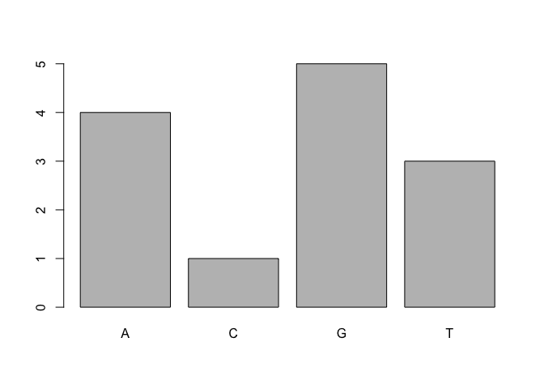

S3 OOP
======

Many of the commonly used R functions use S3 in the background, such as
`plot`, `summary`, `mean`, ...

Lets see how `summary` works. Note that it produces different outputs
for different *types* of inputs:

    df = data.frame(a=1:5, b=6:10)
    vect = 1:5

    class(df)

    ## [1] "data.frame"

    class(vect)

    ## [1] "integer"

    summary(df)

    ##        a           b     
    ##  Min.   :1   Min.   : 6  
    ##  1st Qu.:2   1st Qu.: 7  
    ##  Median :3   Median : 8  
    ##  Mean   :3   Mean   : 8  
    ##  3rd Qu.:4   3rd Qu.: 9  
    ##  Max.   :5   Max.   :10

    summary(vect)

    ##    Min. 1st Qu.  Median    Mean 3rd Qu.    Max. 
    ##       1       2       3       3       4       5

So how does the code for `summary` look like, does it have a lot of
if-else statements to provide different outputs for different types of
inputs? No, it uses S3 OOP to achieve that.

    summary

    ## function (object, ...) 
    ## UseMethod("summary")
    ## <bytecode: 0x7fc7cda31440>
    ## <environment: namespace:base>

    methods(summary)

    ##  [1] summary.aov                    summary.aovlist*              
    ##  [3] summary.aspell*                summary.check_packages_in_dir*
    ##  [5] summary.connection             summary.data.frame            
    ##  [7] summary.Date                   summary.default               
    ##  [9] summary.ecdf*                  summary.factor                
    ## [11] summary.glm                    summary.infl*                 
    ## [13] summary.lm                     summary.loess*                
    ## [15] summary.manova                 summary.matrix                
    ## [17] summary.mlm*                   summary.nls*                  
    ## [19] summary.packageStatus*         summary.PDF_Dictionary*       
    ## [21] summary.PDF_Stream*            summary.POSIXct               
    ## [23] summary.POSIXlt                summary.ppr*                  
    ## [25] summary.prcomp*                summary.princomp*             
    ## [27] summary.proc_time              summary.srcfile               
    ## [29] summary.srcref                 summary.stepfun               
    ## [31] summary.stl*                   summary.table                 
    ## [33] summary.tukeysmooth*          
    ## see '?methods' for accessing help and source code

The algorithm by which an appropriate method is called is called
*dispatching*:

1.  The line of code is `UseMethod("summary")` is the dispatch function
    call, and we call `summary` a *generic function*
2.  The call to this function finds out the class of the first argument
    (ie `class(object)`), and based on it calls the appropriate
    implementation:
    1.  If a function with name `summary.<class name>` exists, it will
        call that one
    2.  If such a function doesn't exist, it calls `summary.default`

Therefore we are effectively calling:

    summary.data.frame(df)  # same as summary(df) because class(df) == "data.frame"

    ##        a           b     
    ##  Min.   :1   Min.   : 6  
    ##  1st Qu.:2   1st Qu.: 7  
    ##  Median :3   Median : 8  
    ##  Mean   :3   Mean   : 8  
    ##  3rd Qu.:4   3rd Qu.: 9  
    ##  Max.   :5   Max.   :10

    summary.default(vect)  # same as summary(vect) because class(vect) == "integer"

    ##    Min. 1st Qu.  Median    Mean 3rd Qu.    Max. 
    ##       1       2       3       3       4       5

What if we wanted `summary(vect)` to output something different? We just
define a new method.

    summary.integer = function(object, ...){
      message("This is our own version of summary for integers!")
    }
    methods("summary")

    ##  [1] summary.aov                    summary.aovlist*              
    ##  [3] summary.aspell*                summary.check_packages_in_dir*
    ##  [5] summary.connection             summary.data.frame            
    ##  [7] summary.Date                   summary.default               
    ##  [9] summary.ecdf*                  summary.factor                
    ## [11] summary.glm                    summary.infl*                 
    ## [13] summary.integer                summary.lm                    
    ## [15] summary.loess*                 summary.manova                
    ## [17] summary.matrix                 summary.mlm*                  
    ## [19] summary.nls*                   summary.packageStatus*        
    ## [21] summary.PDF_Dictionary*        summary.PDF_Stream*           
    ## [23] summary.POSIXct                summary.POSIXlt               
    ## [25] summary.ppr*                   summary.prcomp*               
    ## [27] summary.princomp*              summary.proc_time             
    ## [29] summary.srcfile                summary.srcref                
    ## [31] summary.stepfun                summary.stl*                  
    ## [33] summary.table                  summary.tukeysmooth*          
    ## see '?methods' for accessing help and source code

    summary(vect)

    ## This is our own version of summary for integers!

Therefore, generics and dispatching enable us to re-implement some of
the well-known R functions for any data type, including our own - which
we'll cover next.

### Introducing our own classes

We can also create our own data types (classes). Lets says we want to
wrap two pieces of information:

-   DNA sequence name
-   DNA sequence

into a single new data type. And, we want to implement our own version
of `summary` for this new data type.

To create a new object of our class `MyDNASeq` we just modify the
`class` attribute of any base R object, e.g. a list.

    dna = list(name="Our sequence name", sequence="ATGGATGACGATG")
    class(dna) = "MyDNASeq"
    dna

    ## $name
    ## [1] "Our sequence name"
    ## 
    ## $sequence
    ## [1] "ATGGATGACGATG"
    ## 
    ## attr(,"class")
    ## [1] "MyDNASeq"

At this point we created a new object `dna` with class `MyDNASeq`. We
can now go ahead and plug in our implementation for `summary`:

    summary(dna)

    ##          Length Class  Mode     
    ## name     1      -none- character
    ## sequence 1      -none- character

    summary.MyDNASeq = function(object, ...){
      message("This is a DNA sequence of length ", nchar(dna$sequence))
    }

    summary(dna)

    ## This is a DNA sequence of length 13

You can also introduce generics by creating a function that has
`UseMethod("<name of the generic>")` as the only code.

### Generics from primitives

All primitve functions are implicily generics, e.g. `length`:

    length

    ## function (x)  .Primitive("length")

    methods(length)

    ## [1] length.pdf_doc* length.POSIXlt 
    ## see '?methods' for accessing help and source code

So we can define methods as usual:

    length(dna) # before defining our implementation

    ## [1] 2

    length.MyDNASeq = function(x){
      nchar(x$sequence)
    }

    length(dna)

    ## [1] 13

Here we redefined `length()` to return the number of characters in our
DNA sequence.

### Exercise: create a plotting function for our "MyDNASeq" type

Calling `plot()` on our data doesn't work. Create your own
implementation of `plot()` for `MyDNASeq`. You can put any meaningful
code, e.g. plot a histogram of the distribution of DNA letters.

    plot(dna)

### Solution

    plot.MyDNASeq = function(x, y, ...){
      letters = table(strsplit(x$sequence,""))
      barplot(letters)
    }

    plot(dna)

Issues with S3
--------------

S3 is very informal, with very little consistency checking, so things
can easily go wrong:

    class(dna) = "lm" # dna is now a linear model?!

R lets us set any `class` atribute for any object. However, the object
is invalid and we'll get and error if we try to use it:

    summary(dna)

    ## Error in if (p == 0) {: argument is of length zero

S3 summary
----------

-   New types are created by setting the `class` property of any
    existing base R object, usually a `list`.
-   New methods are created by naming convention `generic.className`.
-   Easy to make errors, e.g. mistype class name, assing nonsensical
    class names, or unknowingly override a method if you use `.` in your
    function names.
-   No consisency checking - no formal guarantee that two objects of
    same class will have the same properties
