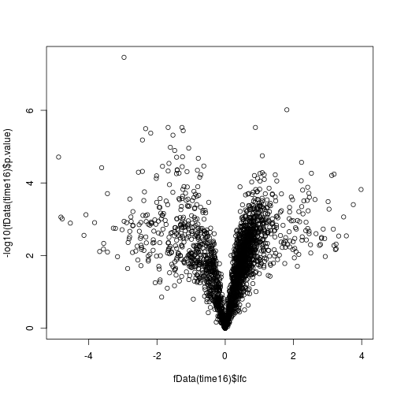
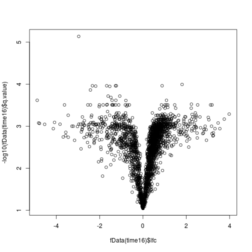
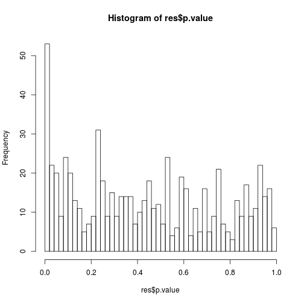

# Identifying differentially expressed proteins


## Running a `t-test` in R

Usig the `t.test` function:

```
t.test(x, y = NULL,
       alternative = c("two.sided", "less", "greater"),
       mu = 0, paired = FALSE, var.equal = FALSE,
       conf.level = 0.95, ...)
```

We will focus on **two sample** unpaires t-test, assuming unequal
variances, as this is the most common scenario in proteomics. Using a
**paired test** when appropriate is essential, as it will
substantially increase your test power.

We are going to use the `rnorm` function in this an the next section
to quickly genreate normally distributed data. Its inputs are 

- `n`: the number of data points to be generated;
- `mean`: the mean of the normal distribution to draw the data from
  (default is 0);
- `sd`: the standard deviation of the normal distribution to draw the
  data from (default is 1).

### Exercise 

* Generate 200 numbers drawn from a normal distribution of mean 0 and
  standard deviation 1. Verify that the parameters of the randomly
  data are correct. What figure would you use to visualise such data?
  
* Same as above for a normal distribution of mean 2 and standard
  deviation 0.5.

* Compare your values with your neighbour's. Are they identical?

Let's now apply a t-test on two sets of values drawn from identical
and different distributions:


```r
t1 <- t.test(rnorm(5), rnorm(5))
t1
```

```
## 
## 	Welch Two Sample t-test
## 
## data:  rnorm(5) and rnorm(5)
## t = -0.29049, df = 5.9876, p-value = 0.7812
## alternative hypothesis: true difference in means is not equal to 0
## 95 percent confidence interval:
##  -1.819747  1.433702
## sample estimates:
## mean of x mean of y 
## 0.2097848 0.4028075
```


```r
t2 <- t.test(rnorm(5), rnorm(5, mean = 4))
t2
```

```
## 
## 	Welch Two Sample t-test
## 
## data:  rnorm(5) and rnorm(5, mean = 4)
## t = -4.9226, df = 8, p-value = 0.00116
## alternative hypothesis: true difference in means is not equal to 0
## 95 percent confidence interval:
##  -4.616365 -1.671030
## sample estimates:
## mean of x mean of y 
## 0.9009366 4.0446341
```

What we see above is a pretty output that is convenient to visualise
interactively. The output of the `t.test` is an object of class 
htest, which contains statistic, parameter, p.value, conf.int, estimate, null.value, alternative, method, data.name 
values.

We can extract any of these with the `$` accessor


```r
t2$p.value
```

```
## [1] 0.001160179
```

## One-sample test 

When using ratio data (as in SILAC or 15N), one would use a **one
sample** t-test.


```r
logsilac <- rnorm(3)
t.test(logsilac, mu = 0)
```

```
## 
## 	One Sample t-test
## 
## data:  logsilac
## t = -1.1196, df = 2, p-value = 0.3793
## alternative hypothesis: true mean is not equal to 0
## 95 percent confidence interval:
##  -1.3418850  0.7877439
## sample estimates:
##  mean of x 
## -0.2770706
```

### Exercise

Let's use the `mulvey2015` dataset, introduced previously, and focus
on time points 1 and 6. 

1. How can we conveniently use the sample metadata to create the
   relevant subset?


2. Use the `t.test` function to test P48432 for differences in
   timepoints 1 and 6.


In high throughput biology, we have to repeat our tests over every
feature (transcript, protein, ...). As we are using a programming
language, this is something easy to do.

Below, we use the apply function, that will iterate a function over
all elements of its input.


```r
time1 <- time16$time == 1
time6 <- time16$time != 1
## first attempt
pv <- apply(exprs(time16), 1,
            function(x) t.test(x[time1], x[time6]))

## second attempt
pv <- apply(exprs(time16), 1,
            function(x) t.test(x[time1], x[time6])$p.value)
```

We now have calculated a p-value for each of the 2337
proteins in the data; let's add them to the feature metadata slot.


```r
fData(time16)$p.value <-
                apply(exprs(time16), 1,
                      function(x) t.test(x[time1], x[time6])$p.value)
```


```r
fData(time16)$fc <-
                apply(exprs(time16), 1,
                      function(x) mean(x[time1])/mean(x[time6]))
fData(time16)$lfc <- log2(fData(time16)$fc)
```

## Visualising results

There are 3 important factors to consider when assessing the results
of a test for differential expression:

* The significance of the test, i.e. the p-values
* The magnitude of the change, i.e. the fold-change
* The (average) intensity of the measurements


```r
MAplot(time16)
```


```r
plot(fData(time16)$lfc, -log10(fData(time16)$p.value))
```


## Multiple testing

See [this section](../multtest/README.md) for details.

Applying this to our data, we obtain


```r
hist(fData(time16)$p.value)
```




```r
library("qvalue")
fData(time16)$q.value <- qvalue(fData(time16)$p.value)$qvalue
```


```r
plot(fData(time16)$lfc, -log10(fData(time16)$q.value))
```



```r
summary(fData(time16)$q.value)
```

```
##      Min.   1st Qu.    Median      Mean   3rd Qu.      Max. 
## 7.320e-06 1.203e-03 2.535e-03 1.064e-02 9.559e-03 8.990e-02
```

## Moderated t-tests: `limma`


## Count data

As discussed in the lecture, count data cannot be handled using a test
for continuous data. One could log-transform the data (adding one to
the data to keep 0 counts). Alternatively, using a dedicated count
distribution has proved successful. Methods originally developed for
high throughput sequencing data, have benefitted from tremebdous
development within the Bioconductor project, and can be readily
applied to proteomics count data.

The *[msmsTests](http://bioconductor.org/packages/msmsTests)* package applies various such count-based
tests on `MSnSet` objects containing spectral counting data. The
package provides a test data `msm.spk`, described as follows in the
manual page:

     A MSnSet with a spectral counts in the expression matrix and a
     treatment factor in the phenoData slot.
     The spectral counts matrix has samples in the columns, and
     proteins in the rows. Each sample consists in 500ng of standard
     yeast lisate spiked with 100, 200, 400 and 600fm of a mix of 48
     equimolar human proteins (UPS1, Sigma-Aldrich). The dataset
     contains a different number of technical replicates of each
     sample.


```r
library("msmsTests")
data(msms.spk)
```
### Exercise

* Familiarise yourself with the experimental design of this
  dataset. Hint: look at the phenoData slot.


* How many samples and proteins are there in the data


```r
dim(msms.spk)
```

* Look at the distribution of all proteins and compare it to the spike
  in proteins. The spikes all contain the suffix `"HUMAN"` that can be
  extracted with the grep function.
  


We are going to model the data according to the negative-binomial
distribution, using the implementation of the *[edgeR](http://bioconductor.org/packages/edgeR)*
package, which uses an empirical Bayes method to share information
across features and is this particularly relevant with a restricted
number of replicates. We will focus on the `U200` and `U600`
conditions.


```r
e <- msms.spk[, msms.spk$treat %in% c("U200", "U600")]
table(e$treat)
```

```
## 
## U100 U200 U400 U600 
##    0    6    0    6
```

We now also need to remove proteins that are left with only 0.


```r
e <- filterZero(e, pNA = 0.99)
```

We can run the NB spectral counts differential test using the
`msms.edgeR`, providing

* an `MSnSet`, here `e`
* an alternative and null hypothesis, `H1` (there is a *treatment*
  effect) and `H0` (there is no effect, the expression is essentially
  constant)
* the groups, `e$treat`
* a column-wise scaling offset (optional)


```r
H0 <- "y ~ 1"
H1 <- "y ~ treat"

## normalising condition
div <- colSums(exprs(e))

res <- msms.edgeR(e, H1, H0,
                  fnm = "treat",
                  div = div)
head(res)
```

```
##               LogFC           LR      p.value
## YKL060C  0.12787365  1.313108448 2.518326e-01
## YDR155C -0.18013963  8.799648268 3.012886e-03
## YOL086C  0.42632911  6.941099054 8.423734e-03
## YJR104C  0.01211616  0.006652729 9.349932e-01
## YGR192C -0.37239199 27.241017293 1.796076e-07
## YLR150W -0.26921988 12.941054872 3.214538e-04
```

### Exercise

* Inspect the p-values distribution and, if relevant, adjust as
  demonstrated above.



* Estimate the number true/false positives and negatives and an alpha
  level of 0.01.


* Visualise the results on a volcano plot


## Other packages

* *[MSstats](http://bioconductor.org/packages/MSstats)* for various statistical analyses
* Isobaric tagging (iTRAQ and TMT): *[isobar](http://bioconductor.org/packages/isobar)*
* Label-free: *[aLFQ](http://cran.fhcrc.org/web/packages/aLFQ/index.html)* and *[protiq](http://cran.fhcrc.org/web/packages/protiq/index.html)*

