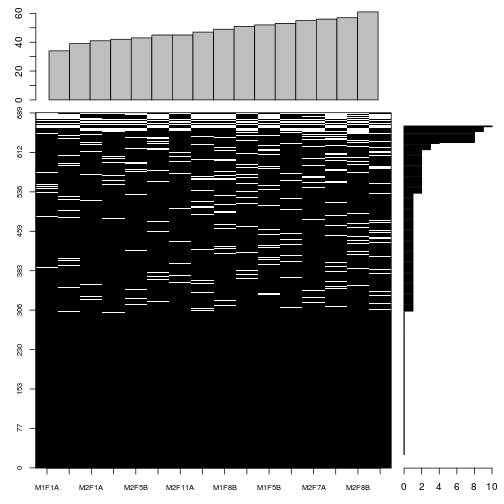
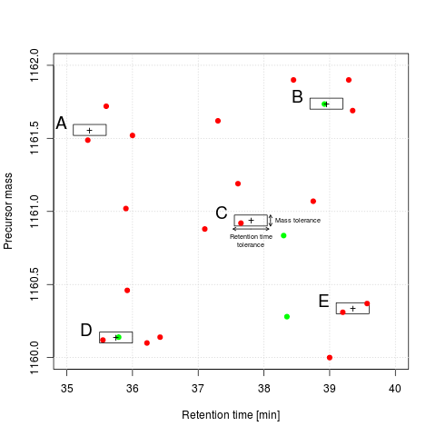
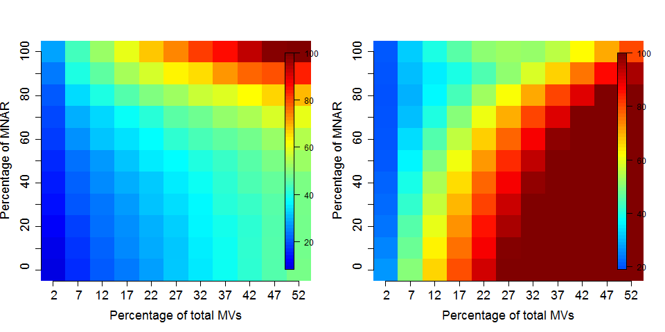

# Missing values in proteomics


```r
library("MSnbase")
data(naset)
naplot(naset, col = "black")
```



```
## features.na
##   0   1   2   3   4   8   9  10 
## 301 247  91  13   2  23  10   2 
## samples.na
## 34 39 41 42 43 45 47 49 51 52 53 55 56 57 61 
##  1  1  1  1  1  2  1  1  1  1  1  1  1  1  1
```

## Filtering

One solution is to remove all or part of the features that have
missing values (see `?filterNA`).


```r
flt <- filterNA(naset)
processingData(flt)
```

```
## - - - Processing information - - -
## Subset [689,16][301,16] Wed Oct 19 08:23:12 2016 
## Removed features with more than 0 NAs: Wed Oct 19 08:23:12 2016 
## Dropped featureData's levels Wed Oct 19 08:23:12 2016 
##  MSnbase version: 1.15.6
```

## Identification transfer

Identification transfer between acquisitions (label-free): if a feature
was not acquired in MS2 in one replicate, it is possible to find the
ion in MS space based on the M/Z and retention time coordinates of the
same ion in a replicate where it was identified. (An example of this
is implemented in the *[synapter](http://bioconductor.org/packages/synapter)* package).



## Imputation

> Missing values are a genuine issue in label-free quantitative
> proteomics. Recent works have surveyed the different statistical
> methods to conduct imputation and have compared them on real or
> simulated datasets, and recommended a list of missing value
> imputation methods for proteomics application. Although insightful,
> these comparisons do not account for two important facts: (i)
> depending on the proteomics dataset, the missingness mechanism may
> be of different natures, and (ii) each imputation method is devoted
> to a specific type of missingness mechanism. As a result, we believe
> that the question at stake is not to find the most accurate
> imputation method in general, but instead, the most appropriate
> one. In this article, we describe a series of comparisons that
> support our views: for instance, we show that a supposedly
> *under-performing* method (i.e. giving baseline average results), if
> applied at the *appropriate* time in the data processing pipeline
> (before or after peptide aggregation) on a dataset with the
> *appropriate* nature of missing values, can outperform a blindly
> applied, supposedly *better performing* method (i.e. the reference
> method from the state-of-the-art). This leads us to formulate few
> practical guidelines, regarding the choice and the application of an
> imputation method in a proteomics context.


It is of course possible to impute missing values. This is however not
a straightforward thing, as is likely to dramatically fail when a high
proportion of data is missing (10s of %). But also, there are two
types of mechanisms resulting in missing values in LC/MSMS
experiments.

* Missing values resulting from absence of detection of a feature,
  despite ions being present at detectable concentrations.  For
  example in the case of ion suppression or as a result from the
  stochastic, data-dependent nature of the MS acquisition
  method. These missing value are expected to be randomly distributed
  in the data and are defined as **missing at random** (MAR) or
  **missing completely at random** (MCAR).

* Biologically relevant missing values, resulting from the *absence*
  or the low abundance of ions (below the limit of detection of the
  instrument). These missing values are not expected to be randomly
  distributed in the data and are defined as **missing not at random**
  (MNAR).
  


Different imputation methods are more appropriate to different classes
of missing values (as documented in this
[paper](http://pubs.acs.org/doi/abs/10.1021/acs.jproteome.5b00981)). Values
missing at random, and those missing not at random should be imputed
with different methods.



It is recommended to use **hot deck** methods (nearest neighbour
(**left**), maximum likelihood, ...) when data are missing at
random. Conversely, MNAR features should ideally be imputed with a
**left-censor** (minimum value (**right**), but not zero, ...) method.

## In `MSnbase`

The `impute` method:

Currently, the following imputation methods are available:

#### MLE 

Maximum likelihood-based imputation method using the EM
algorithm. Implemented in the `norm::imp.norm` function. See
`imp.norm` for details and additional parameters. Note that here,
`...` are passed to the `em.norm` function, rather to the actual
imputation function `imp.norm`.
	   
#### bcpa 

Bayesian missing value imputation are available, as implemented in the
and `pcaMethods::pca` functions. See `pca` for details and additional
parameters.
	   
#### knn 

Nearest neighbour averaging, as implemented in the
`impute::impute.knn` function. See `impute.knn` for details and
additional parameters.

#### QRILC 

A missing data imputation method that performs the imputation of
left-censored missing data using random draws from a truncated
distribution with parameters estimated using quantile
regression. Implemented in the `imputeLCMD::impute.QRILC`
function. See `impute.QRILC` for details and additional parameters.

#### MinDet 

Performs the imputation of left-censored missing data using a
deterministic minimal value approach. Considering a expression data
with *n* samples and *p* features, for each sample, the missing
entries are replaced with a minimal value observed in that sample. The
minimal value observed is estimated as being the q-th quantile
(default `q = 0.01`) of the observed values in that
sample. Implemented in the `imputeLCMD::impute.MinDet` function. See
`impute.MinDet` for details and additional parameters.

#### MinProb 

Performs the imputation of left-censored missing data by random draws
from a Gaussian distribution centred to a minimal value. Considering
an expression data matrix with *n* samples and *p* features, for each
sample, the mean value of the Gaussian distribution is set to a
minimal observed value in that sample. The minimal value observed is
estimated as being the q-th quantile (default `q = 0.01`) of the
observed values in that sample. The standard deviation is estimated as
the median of the feature standard deviations. Note that when
estimating the standard deviation of the Gaussian distribution, only
the peptides/proteins which present more than 50% recorded values are
considered. Implemented in the `imputeLCMD::impute.MinProb`
function. See `impute.MinProb` for details and additional parameters.


#### min 

Replaces the missing values by the smallest non-missing value in the data.


#### zero 
Replaces the missing values by 0.


#### mixed 

A mixed imputation applying two methods (to be defined by the user as
`mar` for values missing at random and `mnar` for values missing not
at random, see example) on two M[C]AR/MNAR subsets of the data (as
defined by the user by a `randna` logical, of length equal to
`nrow(object)`).
	   
#### nbavg 

Average neighbour imputation for fractions collected along a
fractionation/separation gradient, such as sub-cellular fractions. The
method assumes that the fraction are ordered along the gradient and is
invalid otherwise.
	   
Continuous sets `NA` value at the beginning and the end of the
quantitation vectors are set to the lowest observed value in the data
or to a user defined value passed as argument `k`.  Them, when a
missing value is flanked by two non-missing neighbouring values, it is
imputed by the mean of its direct neighbours. A stretch of 2 or more
missing values will not be imputed. 

### Exercise

Walk through the example in the `impute` examples.

### Reference

Lazar C, Gatto L, Ferro M, Bruley C, Burger T. *Accounting for the
Multiple Natures of Missing Values in Label-Free Quantitative
Proteomics Data Sets to Compare Imputation Strategies*. J Proteome
Res. 2016 Apr
1;15(4):1116-25. ([Publisher](http://pubsdc3.acs.org/doi/abs/10.1021/acs.jproteome.5b00981),
[PMID:26906401](http://www.ncbi.nlm.nih.gov/pubmed/26906401),
Software:
[CRAN](https://cran.r-project.org/web/packages/imputeLCMD/index.html)
and
[Bioconductor](http://bioconductor.org/packages/release/bioc/html/MSnbase.html))
