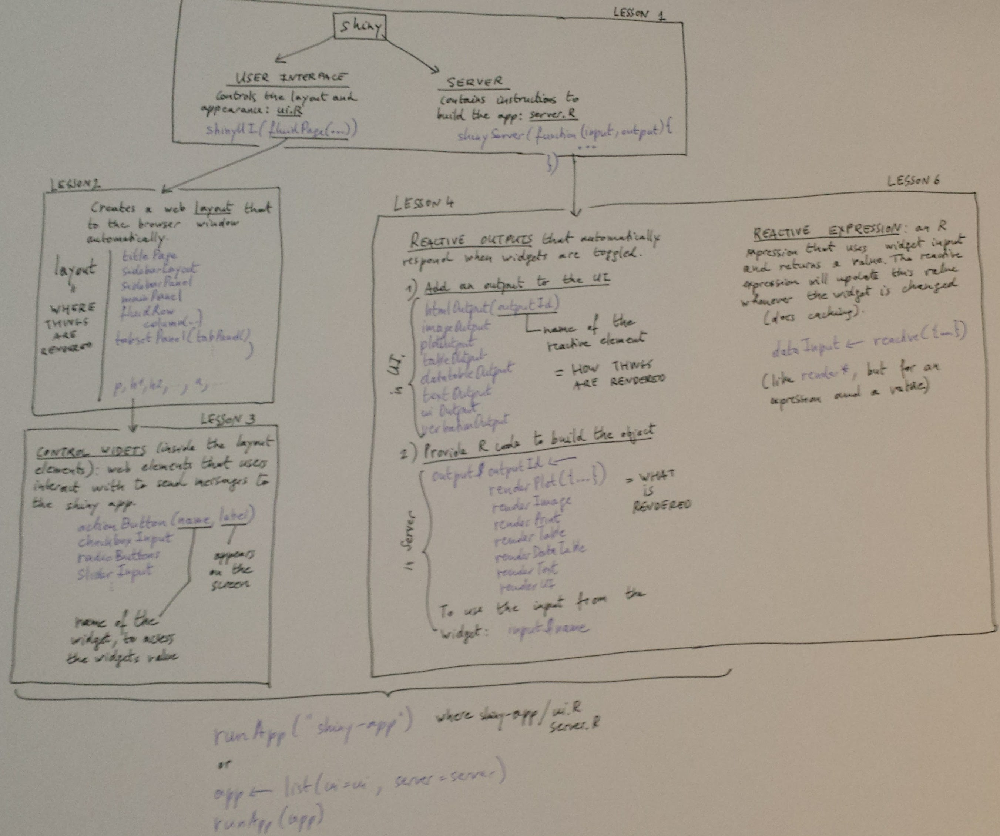

# Interactive apps with `shiny`

We will need


```r
library("shiny")
```

## The architecture of a `shiny` app

The overview figure below is based and makes reference to
[*the written tutorial*](http://shiny.rstudio.com/tutorial/lesson1/).



### Running the apps


```r
## in ui.R
shinyUI(fluidPage(...))
```


```r
## in server.R
shinyServer(function(input, ouput) {
    ...
})
```


```r
runApp("app-dir")
```

### Example apps

* [`shiny-app1`](./shiny-app1)
* [`shiny-app2`](./shiny-app1)

### Single-file app


```r
ui <- fluidPage(...)
server <- function(input, output) { ... }

app <- list(ui = ui, server = server)
runApp(app)
```

### Sharing

* Share the code file(s) and `runApp`
* `runUrl`
* `runGitHub`
* `runGist`
* [shinyapps](http://wwwshinyapps.io)
* Shiny server

## Shiny apps

Push your shiny apps online with [shinyapps](http://www.shinyapps.io/).


## References

* [`shiny` page](http://shiny.rstudio.com/)
* [`shiny` cheat sheet](https://www.rstudio.com/wp-content/uploads/2016/01/shiny-cheatsheet.pdf)

