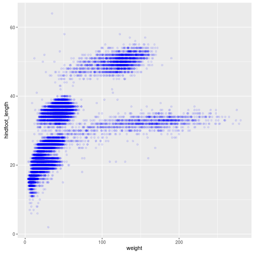
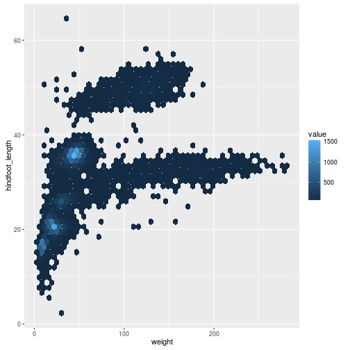
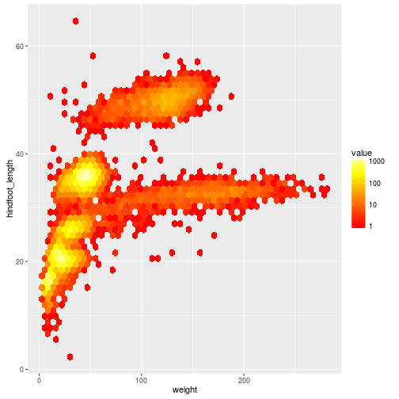
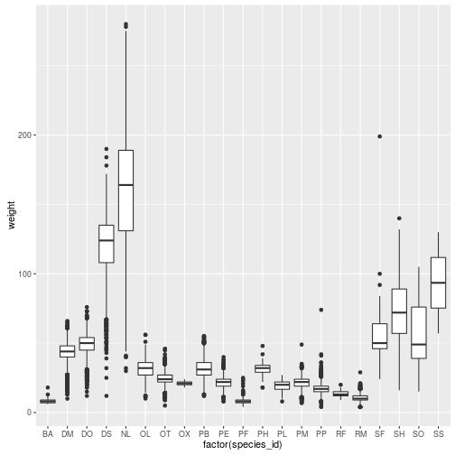
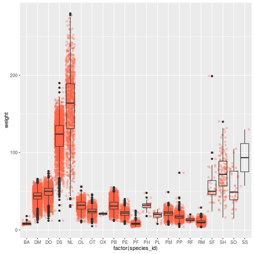
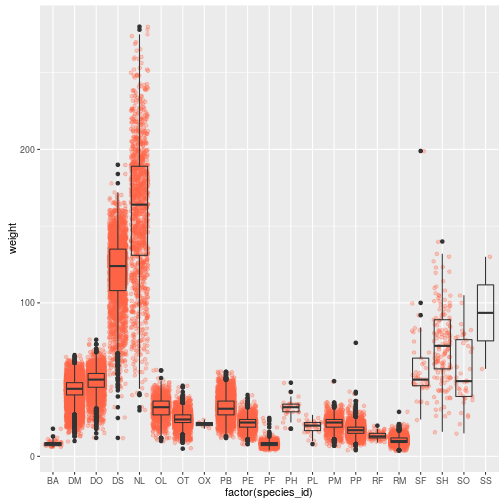
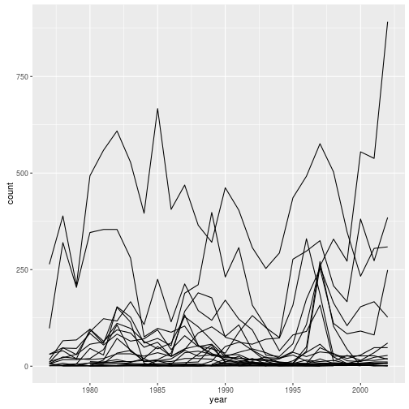
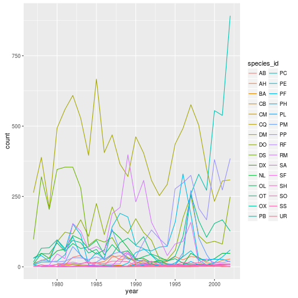
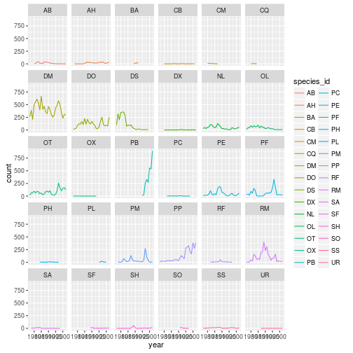
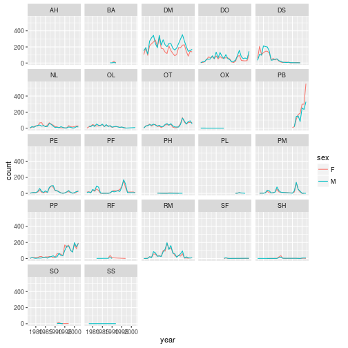

```
## Warning in file(filename, "r", encoding = encoding): cannot open file
## 'setup.R': No such file or directory
```

```
## Error in file(filename, "r", encoding = encoding): cannot open the connection
```

Authors: **Mateusz Kuzak**, **Diana Marek**, **Hedi Peterson**


#### Disclaimer

We will here using functions of `ggplot2` package. There are basic ploting
capabilities in basic R, but `ggplot2` adds more powerful plotting capabilities.

> ### Learning Objectives
>
> - Visualise some of the
>  	[mammals data](http://figshare.com/articles/Portal_Project_Teaching_Database/1314459)
>  	from Figshare
>  	[surveys.csv](http://files.figshare.com/1919744/surveys.csv)
> - Understand how to plot these data using R ggplot2 package. For
>  	more details on using ggplot2 see
>  	[official documentation](http://docs.ggplot2.org/current/).
> -	Building step by step complex plots with ggplot2 package

Load required packages


```r
# plotting package
library("ggplot2")
# piping / chaining
library("magrittr")
# modern dataframe manipulations
library("dplyr")
```

Load data directly from figshare.


```r
surveys_raw <- read.csv("https://ndownloader.figshare.com/files/2292172")
```

This data contains some measurements of the animals caught in plots.

## Data cleaning and preparing for plotting

Let's look at the summary


```r
summary(surveys_raw)
```

```
##    record_id         month             day             year     
##  Min.   :    1   Min.   : 1.000   Min.   : 1.00   Min.   :1977  
##  1st Qu.: 8888   1st Qu.: 4.000   1st Qu.: 9.00   1st Qu.:1984  
##  Median :17775   Median : 6.000   Median :16.00   Median :1990  
##  Mean   :17775   Mean   : 6.474   Mean   :16.11   Mean   :1990  
##  3rd Qu.:26662   3rd Qu.: 9.000   3rd Qu.:23.00   3rd Qu.:1997  
##  Max.   :35549   Max.   :12.000   Max.   :31.00   Max.   :2002  
##                                                                 
##     plot_id       species_id    sex       hindfoot_length     weight      
##  Min.   : 1.0   DM     :10596    : 2511   Min.   : 2.00   Min.   :  4.00  
##  1st Qu.: 5.0   PP     : 3123   F:15690   1st Qu.:21.00   1st Qu.: 20.00  
##  Median :11.0   DO     : 3027   M:17348   Median :32.00   Median : 37.00  
##  Mean   :11.4   PB     : 2891             Mean   :29.29   Mean   : 42.67  
##  3rd Qu.:17.0   RM     : 2609             3rd Qu.:36.00   3rd Qu.: 48.00  
##  Max.   :24.0   DS     : 2504             Max.   :70.00   Max.   :280.00  
##                 (Other):10799             NA's   :4111    NA's   :3266
```

There are few things we need to clean in the dataset.

There is missing species_id in some records. Let's remove those.


```r
surveys <- surveys_raw %>%
           filter(species_id != "")
```

There are a lot of species with low counts, let's remove the ones below 10 counts


```r
# count records per species
species_counts <- surveys %>%
                  group_by(species_id) %>%
                  tally()

# get names of those frequent species
frequent_species <- species_counts %>%
                    filter(n >= 10) %>%
                    select(species_id)

surveys <- surveys %>%
           filter(species_id %in% frequent_species$species_id)
```

We saw in summary, there were `NA`'s in `weight` and
`hindfoot_length`. Let's remove rows with missing weights.


```r
surveys_weight_present <- surveys %>%
                      filter(!is.na(weight))
```

> ### Challenge
>
> - Do the same to remove rows without `hindfoot_length`. Save results
>   in the new dataframe.


```r
surveys_length_present <- surveys %>%
                      filter(!is.na(hindfoot_length))
```

> - How would you get the `data.frame` without missing values?


```r
summary(surveys_length_present)
```

```
##    record_id         month             day             year     
##  Min.   :    1   Min.   : 1.000   Min.   : 1.00   Min.   :1977  
##  1st Qu.: 9772   1st Qu.: 4.000   1st Qu.:10.00   1st Qu.:1984  
##  Median :18642   Median : 7.000   Median :16.00   Median :1991  
##  Mean   :18410   Mean   : 6.545   Mean   :16.12   Mean   :1991  
##  3rd Qu.:27204   3rd Qu.:10.000   3rd Qu.:23.00   3rd Qu.:1997  
##  Max.   :35548   Max.   :12.000   Max.   :31.00   Max.   :2002  
##                                                                 
##     plot_id        species_id   sex       hindfoot_length     weight      
##  Min.   : 1.00   DM     :9972    :   67   Min.   : 2.00   Min.   :  4.00  
##  1st Qu.: 5.00   PP     :3027   F:14889   1st Qu.:21.00   1st Qu.: 20.00  
##  Median :11.00   DO     :2887   M:16461   Median :32.00   Median : 36.00  
##  Mean   :11.24   PB     :2864             Mean   :29.29   Mean   : 41.78  
##  3rd Qu.:17.00   RM     :2442             3rd Qu.:36.00   3rd Qu.: 47.00  
##  Max.   :24.00   OT     :2139             Max.   :70.00   Max.   :280.00  
##                  (Other):8086                             NA's   :699
```

```r
surveys_complete <- surveys_length_present %>%
    filter(!is.na(weight))

anyNA(surveys_complete)
```

```
## [1] FALSE
```

> - Chain both filters together using pipe operator (`%>%`) introduced earlier.


```r
surveys_complete <- surveys %>% 
    filter(!is.na(weight)) %>% 
    filter(!is.na(hindfoot_length))

## also
surveys %>% filter(!is.na(weight), !is.na(hindfoot_length)) %>% anyNA
```

```
## [1] FALSE
```

## Base plotting

Let's start by make a simple scatter plot of `hindfoot_length` (in
millimeters) as a function of `weight` (in grams), using basic R
plotting capabilities.


```r
plot(x = surveys_complete$weight, y = surveys_complete$hindfoot_length)
```


## Plotting with ggplot2

We will make the same plot using `ggplot2` package.

`ggplot2` is a plotting package that makes it simple to create complex plots
from data in a `data.frame`. It uses default settings, which help creating
publication quality plots with minimal amount of settings and tweaking.

With `ggplot2`, graphics are build step by step by adding new elements.

To build such a plot we need to:

- **bind the plot to a specific data frame**


```r
ggplot(data = surveys_complete)
```

- define **aestetics** (`aes`), that map variables in the data to axes on
  the plot or to plotting size, shape color, etc.,


```r
ggplot(data = surveys_complete,
       aes(x = weight, y = hindfoot_length))
```

- add `geoms` -- **graphical representation** of the data in the plot (points,
     lines, bars). To add a geom to the plot use `+` operator:


```r
ggplot(surveys_complete, aes(x = weight, y = hindfoot_length)) +
  geom_point()
```


## Modifying plots

- adding transparency (alpha)


```r
ggplot(surveys_complete, aes(x = weight, y = hindfoot_length)) +
  geom_point(alpha=0.1)
```



- adding colors


```r
ggplot(surveys_complete, aes(x = weight, y = hindfoot_length)) +
  geom_point(alpha=0.1, color="blue")
```



Example of complex visualisation in which plot area is divided into hexagonal
sections and points are counted wihin hexagons. The number of points per hexagon
is encoded by color.


```r
library("hexbin")
```

```
## Loading required package: methods
```

```r
ggplot(surveys_complete, aes(x = weight, y = hindfoot_length)) +
    stat_binhex(bins=50) 
```




```r
ggplot(surveys_complete, aes(x = weight, y = hindfoot_length)) +
    stat_binhex(bins=50) +
    scale_fill_gradientn(trans="log10", colours = heat.colors(10, alpha=0.5))
```



(See the `hexbin` function for a non-`ggplot2` alternative)

## Boxplot

Visualising the distribution of weight within each species.


```r
ggplot(surveys_weight_present, aes(factor(species_id), weight)) +
                   geom_boxplot()
```



By adding points to boxplot, we can see particular measurements and the
abundance of measurements.


```r
ggplot(surveys_weight_present, aes(factor(species_id), weight)) +
                   geom_jitter(alpha=0.3, color="tomato") +
                   geom_boxplot(alpha=0)
```



(See `boxplot` for a base function.)

> ### Challenge
>
> Create boxplot for `hindfoot_length`.


## Plotting time series data

Let's calculate number of counts per year for each species. To do that we need
to group data first and count records within each group.


```r
yearly_counts <- surveys %>%
                 group_by(year, species_id) %>%
                 summarise(count=n())
```

Timelapse data can be visualised as a line plot with years on x axis and counts
on y axis.


```r
ggplot(yearly_counts, aes(x=year, y=count)) +
                  geom_line()
```



Unfortunately this does not work, because we plot data for all the species
together. We need to tell ggplot to split graphed data by `species_id`


```r
ggplot(yearly_counts, aes(x=year, y=count, group=species_id)) +
  geom_line()
```



We will be able to distiguish species in the plot if we add colors.


```r
ggplot(yearly_counts, aes(x=year, y=count, group=species_id, color=species_id)) +
  geom_line()
```



## Faceting

ggplot has a special technique called *faceting* that allows to split one plot
into mutliple plots based on some factor. We will use it to plot one time series
for each species separately.


```r
ggplot(yearly_counts, aes(x=year, y=count, color=species_id)) +
  geom_line() + facet_wrap(~species_id)
```


Now we would like to split lines in each plot by sex of each individual
measured. To do that we need to make **counts grouped by sex**.

> ### Challenges:
>
> - filter the dataframe so that we only keep records with sex "F" or "M"s
>


```r
sex_values <- c("F", "M")
surveys <- surveys %>%
           filter(sex %in% sex_values)
```

> - group by year, species_id, sex


```r
yearly_sex_counts <- surveys %>%
                     group_by(year, species_id, sex) %>%
                     summarise(count=n())
```

> - Let's now make the faceted plot spliting further by sex (within single plot)


```r
ggplot(yearly_sex_counts, aes(x=year, y=count, color=species_id, group=sex)) +
  geom_line() + facet_wrap(~ species_id)
```

```
## geom_path: Each group consists of only one observation. Do you need to
## adjust the group aesthetic?
```



> - Improve the plot by coloring by sex instead of species (species
>   are already in separate plots, so we don't need to distinguish
>   them better)


```r
ggplot(yearly_sex_counts, aes(x=year, y=count, color=sex, group=sex)) +
  geom_line() + facet_wrap(~ species_id)
```

```
## geom_path: Each group consists of only one observation. Do you need to
## adjust the group aesthetic?
```


