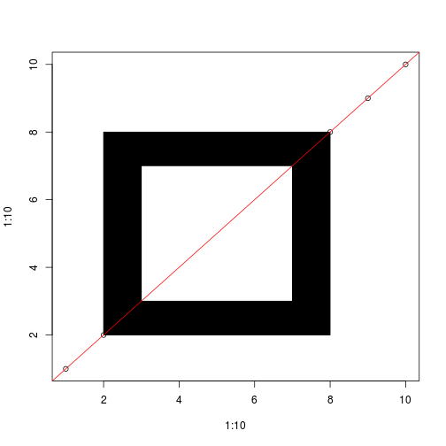
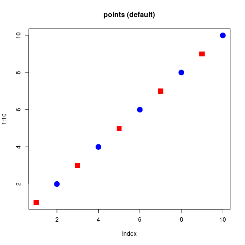
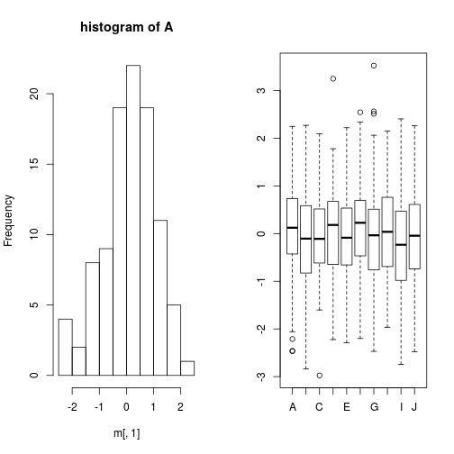
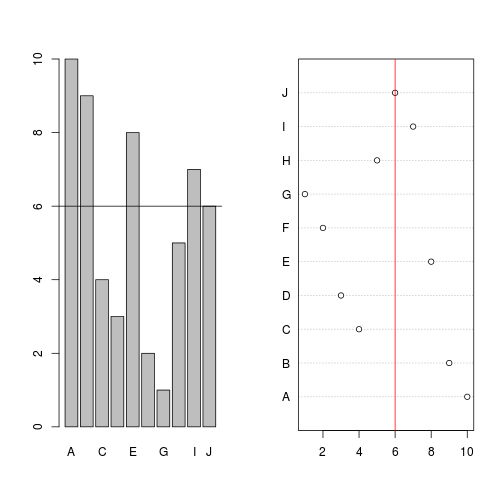
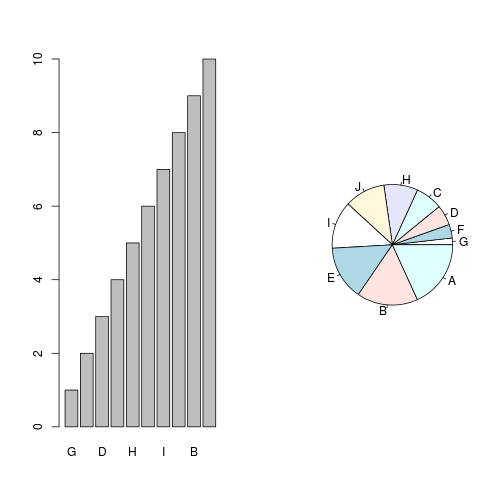
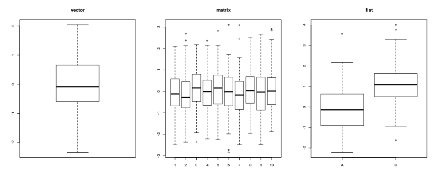
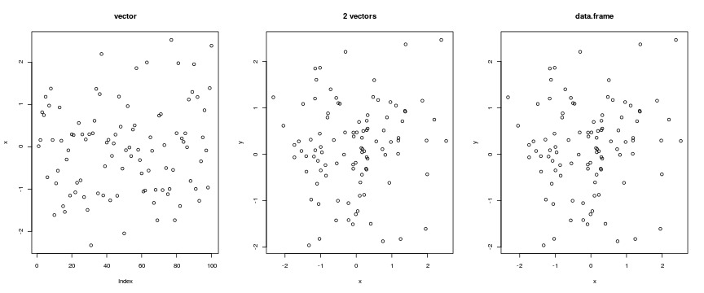
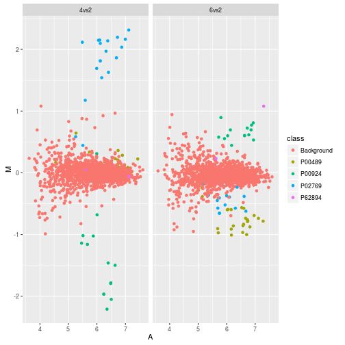

> ## Objectives
>
> * Learn base graphics plotting function
> * Learn some basic customisation
> * Other plotting frameworks: `ggplot2` and `lattice`
> * Save plot(s) as pdf/png.


# Motivations


Anscombe's quartet are four x-y datasets which have the same
traditional statistical properties (mean, variance, correlation,
regression line, etc.), yet are very different. These difference
become clear when the data are visualised.

<table>
 <thead>
  <tr>
   <th style="text-align:right;"> x1 </th>
   <th style="text-align:right;"> x2 </th>
   <th style="text-align:right;"> x3 </th>
   <th style="text-align:right;"> x4 </th>
   <th style="text-align:right;"> y1 </th>
   <th style="text-align:right;"> y2 </th>
   <th style="text-align:right;"> y3 </th>
   <th style="text-align:right;"> y4 </th>
  </tr>
 </thead>
<tbody>
  <tr>
   <td style="text-align:right;"> 10 </td>
   <td style="text-align:right;"> 10 </td>
   <td style="text-align:right;"> 10 </td>
   <td style="text-align:right;"> 8 </td>
   <td style="text-align:right;"> 8.04 </td>
   <td style="text-align:right;"> 9.14 </td>
   <td style="text-align:right;"> 7.46 </td>
   <td style="text-align:right;"> 6.58 </td>
  </tr>
  <tr>
   <td style="text-align:right;"> 8 </td>
   <td style="text-align:right;"> 8 </td>
   <td style="text-align:right;"> 8 </td>
   <td style="text-align:right;"> 8 </td>
   <td style="text-align:right;"> 6.95 </td>
   <td style="text-align:right;"> 8.14 </td>
   <td style="text-align:right;"> 6.77 </td>
   <td style="text-align:right;"> 5.76 </td>
  </tr>
  <tr>
   <td style="text-align:right;"> 13 </td>
   <td style="text-align:right;"> 13 </td>
   <td style="text-align:right;"> 13 </td>
   <td style="text-align:right;"> 8 </td>
   <td style="text-align:right;"> 7.58 </td>
   <td style="text-align:right;"> 8.74 </td>
   <td style="text-align:right;"> 12.74 </td>
   <td style="text-align:right;"> 7.71 </td>
  </tr>
  <tr>
   <td style="text-align:right;"> 9 </td>
   <td style="text-align:right;"> 9 </td>
   <td style="text-align:right;"> 9 </td>
   <td style="text-align:right;"> 8 </td>
   <td style="text-align:right;"> 8.81 </td>
   <td style="text-align:right;"> 8.77 </td>
   <td style="text-align:right;"> 7.11 </td>
   <td style="text-align:right;"> 8.84 </td>
  </tr>
  <tr>
   <td style="text-align:right;"> 11 </td>
   <td style="text-align:right;"> 11 </td>
   <td style="text-align:right;"> 11 </td>
   <td style="text-align:right;"> 8 </td>
   <td style="text-align:right;"> 8.33 </td>
   <td style="text-align:right;"> 9.26 </td>
   <td style="text-align:right;"> 7.81 </td>
   <td style="text-align:right;"> 8.47 </td>
  </tr>
  <tr>
   <td style="text-align:right;"> 14 </td>
   <td style="text-align:right;"> 14 </td>
   <td style="text-align:right;"> 14 </td>
   <td style="text-align:right;"> 8 </td>
   <td style="text-align:right;"> 9.96 </td>
   <td style="text-align:right;"> 8.10 </td>
   <td style="text-align:right;"> 8.84 </td>
   <td style="text-align:right;"> 7.04 </td>
  </tr>
  <tr>
   <td style="text-align:right;"> 6 </td>
   <td style="text-align:right;"> 6 </td>
   <td style="text-align:right;"> 6 </td>
   <td style="text-align:right;"> 8 </td>
   <td style="text-align:right;"> 7.24 </td>
   <td style="text-align:right;"> 6.13 </td>
   <td style="text-align:right;"> 6.08 </td>
   <td style="text-align:right;"> 5.25 </td>
  </tr>
  <tr>
   <td style="text-align:right;"> 4 </td>
   <td style="text-align:right;"> 4 </td>
   <td style="text-align:right;"> 4 </td>
   <td style="text-align:right;"> 19 </td>
   <td style="text-align:right;"> 4.26 </td>
   <td style="text-align:right;"> 3.10 </td>
   <td style="text-align:right;"> 5.39 </td>
   <td style="text-align:right;"> 12.50 </td>
  </tr>
  <tr>
   <td style="text-align:right;"> 12 </td>
   <td style="text-align:right;"> 12 </td>
   <td style="text-align:right;"> 12 </td>
   <td style="text-align:right;"> 8 </td>
   <td style="text-align:right;"> 10.84 </td>
   <td style="text-align:right;"> 9.13 </td>
   <td style="text-align:right;"> 8.15 </td>
   <td style="text-align:right;"> 5.56 </td>
  </tr>
  <tr>
   <td style="text-align:right;"> 7 </td>
   <td style="text-align:right;"> 7 </td>
   <td style="text-align:right;"> 7 </td>
   <td style="text-align:right;"> 8 </td>
   <td style="text-align:right;"> 4.82 </td>
   <td style="text-align:right;"> 7.26 </td>
   <td style="text-align:right;"> 6.42 </td>
   <td style="text-align:right;"> 7.91 </td>
  </tr>
  <tr>
   <td style="text-align:right;"> 5 </td>
   <td style="text-align:right;"> 5 </td>
   <td style="text-align:right;"> 5 </td>
   <td style="text-align:right;"> 8 </td>
   <td style="text-align:right;"> 5.68 </td>
   <td style="text-align:right;"> 4.74 </td>
   <td style="text-align:right;"> 5.73 </td>
   <td style="text-align:right;"> 6.89 </td>
  </tr>
</tbody>
</table>


|         |          1|          2|          3|          4|
|:--------|----------:|----------:|----------:|----------:|
|var(x)   | 11.0000000| 11.0000000| 11.0000000| 11.0000000|
|mean(x)  |  9.0000000|  9.0000000|  9.0000000|  9.0000000|
|var(y)   |  4.1272691|  4.1276291|  4.1226200|  4.1232491|
|mean(y)  |  7.5009091|  7.5009091|  7.5000000|  7.5009091|
|cor(x,y) |  0.8164205|  0.8162365|  0.8162867|  0.8165214|


The goal of visualisation is to **explore** the data to identify
**unexpected** patterns. R is particularly well suited because if
offers

* high-level plotting functions that produce useful figures with
  minimal efforts and enables

* flexibility and customisation to produce specialised/customized
  figures

# Base plotting

**Painters model**: Graphical elements are added to the canvas one
  layer at a time, and the picture builds up in levels. Lower levels
  are obscured by higher levels, allowing for blending, masking and
  overlaying of objects.


```r
plot(1:10, 1:10)
rect(2, 2, 8, 8, col = "black")
rect(3, 3, 7, 7, col = "white")
abline(0, 1, col = "red")
```



## High level plotting functions

High level plotting functions produce an appropriate chart based on the input.

### Scatter plots

`plot` is the generic plotting function. By default produces scatter
plots but other types can be set.


```r
  plot(x, y = NULL, type = "p",  xlim = NULL, ylim = NULL,
       log = "", main = NULL, sub = NULL, xlab = NULL, ylab = NULL,
       col = "black", cex = 1, pch = 1, ...)
```


```r
par(mfrow = c(2, 2))
plot(1:10, type = "p", main = "points (default)")
plot(1:10, type = "l", main = "lines")
plot(1:10, 10:1, type = "b", main = "both (points and lines)")
plot(1:10, type = "h", main = "histogram")
```


Setting colours and point character


```r
plot(1:10, col = c("red", "blue"),
     pch = c(15, 19), cex = 2,
     main = "points (default)")
```



### Challenge

1. Reproduce the figures above. Then customize the last figure so
   that even points are discribed with plus and odd points with an
   empty diamond. All plotting symbols should be of colour
   `"steelblue"`. See `?points` for details about plotting
   characters. Then, set the title of your plot using either `main`
   as argument to `plot` (as above) or with the `title` function.

2. Load the `madata.rda` data set. This data represents quantitative
   proteomics data. Inspect the data: how many rows and columns,
   what class is `madata`? Produce an MA-plot, i.e the log2
   fold-change (`M`) as a function of the average expression
   intensity (`A`) using the `plot` function.


### Distributions


```r
m <- matrix(rnorm(1000), ncol = 10)
colnames(m) <- LETTERS[1:10]
par(mfrow = c(1, 2))
hist(m[, 1], main  = "histogram of A")
boxplot(m)
```



### Counts


```r
x <- sample(10)
names(x) <- LETTERS[1:10]
par(mfrow = c(1, 2))
barplot(x)
abline(h = 6)
dotchart(x)
abline(v = 6, col = "red")
```



> ## Tip
>
> There is also a `pie` function to produce pie charts, which is
> however not recommended, as areas are much more difficult to compare
> that heights. Contrast the following bar and pie charts:
>
> 

### Heatmap


```r
heatmap(m)
```


## These functions are methods

These high-level functions have customised behaviour that depends on their inputs:

* A `boxplot` of a `vector`, `a matrix` or a `list`:


```r
par(mfrow = c(1, 3))
boxplot(rnorm(100), main = "vector")
m <- matrix(rnorm(1000), ncol = 10)
boxplot(m, main = "matrix")
ll <- list(A = rnorm(100), B = rnorm(100, 1))
boxplot(ll, main = "list")
```



* A `plot` of 1 of 2 `vector`s of a `data.frame`:


```r
par(mfrow = c(1, 3))
x <- rnorm(100)
plot(x, main = "vector")
y <- rnorm(100)
plot(x, y, main = "2 vectors")
dfr <- data.frame(x, y)
plot(dfr, main = "data.frame")
```



## Low level interaction

Low level interaction with the drawing device to build up a figure piece by piece.

```
  points, lines, rect, arrows, axis, abline, ...
```

### Tip

The `colours()` function returns a vector of `length(colours())`
colour names. One can also use one of the pre-defined colour
palettes: `rainbow(n)`, `heat.colors(n)`, `terrain.colours(n)`,
`topo.colors(n)`, `cm.colors(n)`, where `n` defined the number of
colours. The `RColorBrewer` package offers well characterised
palettes; see for example


```r
library("RColorBrewer")
display.brewer.all()
```


# `ggplot2`

We need to install and load the package first.


```r
install.packages("ggplot2")
library("ggplot2")
```

Based on the Grammar of Graphics

* A plot is made up of multiple layers
* A layer consists of data (must be a `data.frame`), a set of mappings
  between variables and aesthetics (`aes`), a geometric object (`geom`)
  and a statistical transformation
* Scales control the details of the mapping
* All components are independent and reusable


```r
load("../data/madata.rda")
ggplot(data = madata, aes(x = A, y = M, colour = class)) +
    geom_point()
```


```r
load("../data/madata2.rda")
head(madata2)
```

```
##           A            M data protein      class
## 2  7.046010 -0.031266127 4vs2 ECA0625 Background
## 5  7.090470 -0.020368859 4vs2 ECA0625 Background
## 6  6.108037 -0.088470638 4vs2 ECA0625 Background
## 8  6.764458  0.155656421 4vs2 ECA0625 Background
## 10 7.275194  0.144162890 4vs2 ECA0625 Background
## 11 7.011953 -0.005855139 4vs2 ECA0625 Background
```

```r
tail(madata2)
```

```
##              A             M data protein      class
## 23061 4.748683 -0.1696683555 6vs2 ECA2541 Background
## 23091 5.576012  0.0004449593 6vs2 ECA4517 Background
## 23141 5.524194 -0.1757914391 6vs2 ECA1777 Background
## 23251 4.649809 -0.2185994857 6vs2 ECA0765 Background
## 23351 5.916290  0.0531455603 6vs2 ECA1148 Background
## 23481 5.537965 -0.0640589155 6vs2 ECA3291 Background
```

```r
ggplot(data = madata2, aes(x = A, y = M, colour = class)) +
    geom_point() + facet_grid(. ~ data)
```



More details: `ggplot2` [web page](http://ggplot2.org/) and
[book](http://www.amazon.com/dp/0387981403) (slightly outdated
though, second edition on its way).

# `lattice`

The `lattice` package provides its own set of high-level plotting
functions for `data.frames`, with an emphasis on multivariate data
visualisation. It makes heavily use of the formula interface to
produce effective data visualisations.


```r
library("lattice")
xyplot(M ~ A, data = madata, col = madata$class)
```


```r
xyplot(M ~ A | data, data = madata2, col = madata$class)
```


More details:
[Lattice: Multivariate Data Visualization with R](http://lmdvr.r-forge.r-project.org/figures/figures.html)
book.

## Overview table


|plot type     |traditional      |lattice                           |ggplot2                         |
|:-------------|:----------------|:---------------------------------|:-------------------------------|
|scatterplots  |plot             |xyplot                            |geom_point                      |
|histograms    |hist             |histgram                          |geom_histogram                  |
|density plots |plot(density())  |densityplot                       |geom_density                    |
|boxplots      |boxplot          |bwplot                            |geom_boxplot                    |
|violin plots  |vioplot::vioplot |bwplot(..., panel = panel.violin) |geom_violin                     |
|line plots    |plot, matplot    |xyploy, parallelplot              |geom_line                       |
|bar plots     |barplot          |barchart                          |geom_bar                        |
|pie charts    |pie              |                                  |geom_bar with polar coordinates |
|dot plots     |dotchart         |dotplot                           |geom_point                      |
|stip plots    |stripchart       |stripplot                         |goem_point                      |
|dendrogramms  |plot(hclust())   |latticeExtra package              |ggdendro package                |
|heatmaps      |image, heatmap   |levelplot                         |geom_tile                       |

# Saving plots 

The functions `pdf` redirects all the plots generated by R into a pdf
file, rather than rendering them on the screen. After we are done
generating our plot to be saved in the file, we stop R from
redirecting plots with the function `dev.off`.


```r
pdf("myplot.pdf")
plot(1:10)
dev.off()
```

There are similar devive functions for other formats: `png()` to save
a plot to a png file, `postscript()` for a ps file, `jpeg()` for a jpg
file, ...

## Interactive graphics


```r
dfr <- data.frame(x = rnorm(10),
                  y = rnorm(10))
rownames(dfr) <- LETTERS[1:10]
plot(dfr)
text(dfr$x, dfr$y, rownames(dfr), pos = 3)
```


```r
plot(dfr)
identify(dfr, labels = rownames(dfr))
```

Not covered here: `shiny`
([example](https://lgatto.shinyapps.io/shinyMA/)), `htmlwidgets`,
`rCharts`, `googleVis`.

## Resources

* [R Graphics Cookbook](http://www.amazon.com/dp/1449316956)
* [R Graphics](https://www.stat.auckland.ac.nz/%7Epaul/RG2e/) book
* [R Graphical Manual](http://rgm3.lab.nig.ac.jp/RGM/R_image_list?page=1133&init=true)
